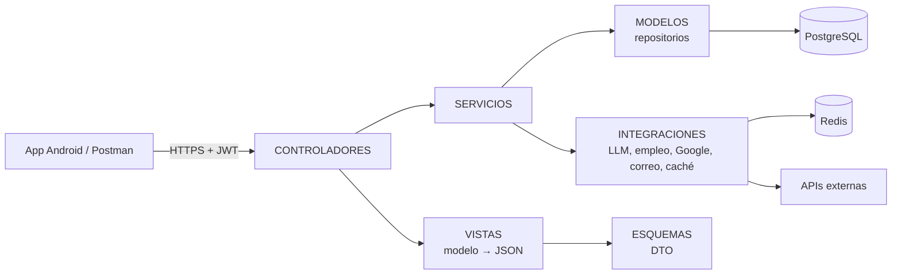

# Arquitectura general

API REST monolítica en **Kotlin + Ktor** ([[Kotlin y Ktor]]), con **PostgreSQL** como fuente de verdad
([[PostgreSQL y Exposed]]) y **Redis** como caché y contador compartido ([[Redis]]). Organizada en **capas MVC +
servicios** con nombres en español ([[Convenciones de codigo]]).

## Carpetas (`src/main/kotlin`)
| Carpeta | Responsabilidad | Ejemplo |
|---|---|---|
| `CONTROLADORES/` | Rutas Ktor. **Delgados**: leen la petición, llaman al servicio, responden con la vista. Sin SQL ni reglas | `CONTROLADOR_ENTREVISTA.kt` |
| `SERVICIOS/` | Reglas de negocio. No conocen HTTP. Reciben dependencias por constructor (interfaces) | `SERVICIO_ENTREVISTA.kt` |
| `MODELOS/` | Tablas Exposed (`TABLA_*`), modelos de dominio (`MODELO_*`) y repositorios (`REPOSITORIO_*`, interfaz + `*Exposed`). **Único lugar con SQL** | `REPOSITORIO_SESION_ENTREVISTA.kt` |
| `ESQUEMAS/` | DTO de entrada/salida (`@Serializable`). Definen el contrato JSON | `ESQUEMA_ENTREVISTA.kt` |
| `VISTAS/` | Conversión modelo → DTO (funciones de extensión `aRespuesta()`) | `VISTA_ENTREVISTA.kt` |
| `INTEGRACIONES/` | Clientes de servicios externos detrás de interfaces | `PROVEEDOR_LLM.kt`, `CLIENTE_CACHE.kt` |
| `ERRORES/` | Jerarquía de errores de dominio | `ERRORES_APLICACION.kt` |
| `MIDDLEWARES/` | Autenticación y `soloAdmin { }` | `MIDDLEWARE_SOLO_ADMIN.kt` |
| `CONFIGURACION/` | Configuración (lee `.env`), plugins de Ktor, rutas, **contenedor de dependencias**, constantes | `CONTENEDOR_DEPENDENCIAS.kt` |
| `UTILIDADES/` | Ayudas transversales: transacciones, JWT, contraseñas, parámetros, resiliencia | `UTILIDAD_RESILIENCIA.kt` |

Flujo permitido: **CONTROLADOR → SERVICIO → MODELO / INTEGRACION**. Nunca un controlador habla con un repositorio
ni un servicio arma una respuesta HTTP.

## Arranque
`Application.kt` → lee `ConfiguracionGeneral` (falla al iniciar si falta una variable obligatoria) → instala
serialización, CORS, errores, límites, monitoreo, base de datos y seguridad → crea `ContenedorDependencias`
(**único lugar donde se instancian repositorios, integraciones y servicios**) → `configurarRutas` monta los controladores
→ inicia tareas en segundo plano (sincronización semanal del mercado).

## Una petición, de punta a punta
1. Ktor valida el JWT (`authenticate("auth-jwt")`) y, si corresponde, `soloAdmin`.
2. El controlador deserializa el `ESQUEMA`, obtiene `usuarioId` del token y llama al servicio.
3. El servicio valida reglas, usa repositorios (cada uno abre su transacción en el pool de IO) e integraciones.
4. Si algo no cumple, lanza un error de dominio (`ErrorValidacion`, `ErrorConflicto`…); `CONFIGURACION_ERRORES`
   lo traduce a HTTP con el cuerpo estándar `{error, mensaje, message}` → [[Manejo de errores y resiliencia]].
5. El controlador responde con la `VISTA` correspondiente.

## Tareas en segundo plano
- **Reporte de entrevista**: al finalizar, `ServicioReporteEntrevista` corre en un `CoroutineScope` del contenedor.
- **Correos** de recuperación (no bloquean la respuesta).
- **Sincronización del mercado** cada 7 días (espera lo que falte desde la última; no gasta cuota en cada reinicio).

## Contratos que no se pueden romper
La app Android usa rutas y nombres de campos antiguos (`/api/prueba-practica/*`, `/auth/*`, `/billing/*` en snake_case,
errores de registro con `{"error": "..."}`). Están cubiertos por pruebas que usan **copias de los DTO de la app**.
Ver [[Guia para agentes]] y [[API]].

Relacionado: [[Modelo de datos]] · [[Flujos de negocio]] · [[Decisiones]]
