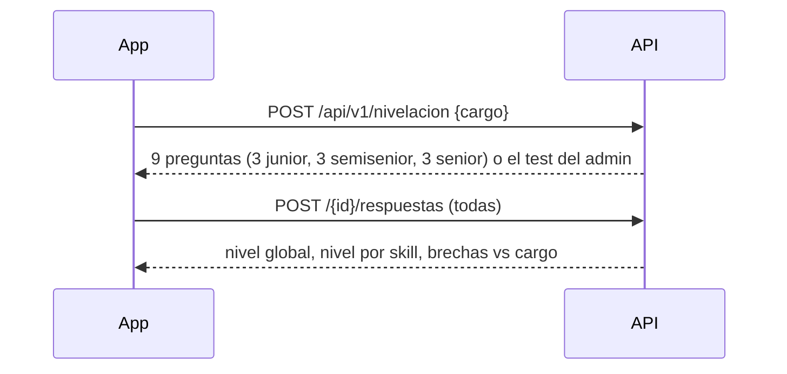
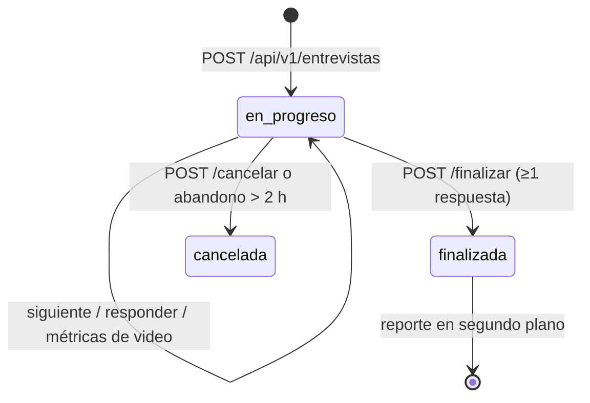

# Flujos de negocio

Endpoints exactos y bodies en `../documentacion/API.md`. Aquí, **qué pasa y por qué**.

## 1. Cuenta y onboarding
`POST /auth/register` (o login con Google) → `PUT /perfil/objetivo` con **área, cargo meta y nivel**.
El cargo meta queda en `objetivo_carrera` y el nivel en `perfil_usuario`; los demás flujos los usan por defecto.

## 2. Selección de preguntas (compartida)
`SelectorPreguntas` elige preguntas **aprobadas** del nivel pedido, por categoría:
1. preguntas del **cargo** → 2. de las **skills del cargo** (`cargo_skill`) → 3. **generales**.
Evita las vistas en las últimas sesiones mientras el banco alcance. Si el cargo no está en el catálogo, usa técnicas
de cualquier skill sin cargo asignado. `ResolutorContextoPrueba` completa cargo y nivel desde el perfil/objetivo.

## 3. Nivelación (Flujo 1)

- **Nivel**: se sube junior → semisenior → senior mientras el promedio del nivel sea ≥ 60; un nivel sin preguntas corta la subida. Sin responder = 0.
- **Brecha** por skill contra `cargo_skill.nivel_requerido`; prioridad alta si faltan 2 niveles o es obligatoria.
- Guarda `intento_test`, `resultado_nivelacion` y acumula `nivel_skill_usuario` (fija el nivel de cada skill). Se rinde **una vez**.
- No cambia el nivel del perfil: se informa como *nivel sugerido*.

## 4. Práctica (Flujo 2)
`POST /api/v1/practicas` (por skill o por cargo; modo alternativas/abiertas/mixto) → por cada respuesta
`POST /{id}/respuestas` devuelve **feedback inmediato** → `POST /{id}/finalizar`.
- Alternativas: correcta/incorrecta + explicación de la opción. Abiertas: **motor freemium** (correcta desde 60).
- Una práctica en curso a la vez (empezar otra abandona la anterior). Suma puntaje a la skill, **no cambia su nivel**.
- **Offline**: la app sincroniza intentos con `POST /api/v1/sync/attempts`, idempotente por `localAttemptId`; si la pregunta
  existe en el banco se vuelve a corregir en el servidor.

## 5. Simulación de entrevista (Flujo 3)

- 60 % técnicas / 40 % blandas; **una sola entrevista en curso** por usuario (bloqueo + índice único).
- Cada pregunta se responde **una vez**; la corrección se oculta hasta finalizar; entrevistas ajenas = 404.
- Métricas de video en lotes de hasta 300 (contacto visual, postura, confianza, expresión).

## 6. Reporte de feedback (Fase 7)
`ServicioReporteEntrevista` se dispara al finalizar. Estado `generando → listo | error`.
1. Evalúa respuestas abiertas: **freemium** o **IA si el usuario es premium** y hay LLM configurado (una llamada por entrevista; si falla, freemium).
2. Puntajes: **técnico**, **blando**, **lenguaje corporal** (promedio de métricas). Global = 50/30/20, repartiendo lo que no se midió. Sin responder = 0.
3. Radar por skill, fortalezas, áreas de mejora, recomendaciones (skills del cargo bajo 60; alta si obligatoria), resumen.
4. Guarda la corrección en cada respuesta y acumula puntaje en `nivel_skill_usuario`.
- Error → código interno en BD, mensaje claro al usuario, **reintento manual** (máx. 3 intentos en total). Generación atómica: nunca dos a la vez.

## 7. App Android (`/api/prueba-practica`)
La app rinde cada prueba **de una vez**: `POST /front` con `tipoPrueba` `ENT` (entrevista) · `PR`/`BL` (práctica técnica/blanda) · `NV`
(nivelación), y `POST /{pruebaId}/respuestas` con todas las respuestas. `ServicioPruebasApp` deriva al servicio que corresponde.
`GET /intentos` junta el historial de todo.

## 8. Mercado laboral
Cada 7 días se consultan ofertas (JSearch → Remotive → Arbeitnow → dataset de contingencia), se normalizan skills
(`NormalizadorSkill`), se actualiza la demanda y los requisitos por cargo. Caché Redis en las lecturas. → [[APIs de empleo]]

Relacionado: [[Modelo de datos]] · [[Arquitectura general]] · [[LLM OpenAI y Anthropic]]
